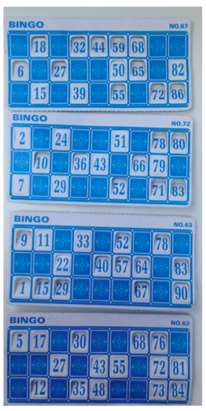

## Hacker edition: Bingo

{:.inline}  

Op vakantie spelen vier kinderen een potje bingo. In het spel zijn 90 balletjes met getallen van 1 t/m 90. Elke speler krijgt een
bingokaart met 15 getallen en er wordt steeds 1 balletje uit de pot gehaald. Wie het eerst al zijn getallen 'vol' heeft heeft gewonnen.
Tijdens een van de spelletjes waren er 7 balletjes over toen de eerste persoon bingo had (er waren dus 83 balletjes getrokken). Dat lijkt
vrij bijzonder, maar dat is lastig in te schatten. De vraag is nu: *hoe* bijzonder is dit?

Concreet: gebruik dezelfde 4 bingo-kaarten, maar simuleer steeds een nieuw potje bingo. Welke fractie van bingo spelletjes is pas afgelopen nadat er 83 of meer balletjes getrokken zijn?

Note: je mag de volgende syntax gebruiken om element `i` uit een lijst te halen: `del L_getallen[i]`.

	>> L getallen = [990,34,12,56]
	>> del L getallen[2]
	>> print L getallen
	[990,34, 56]
