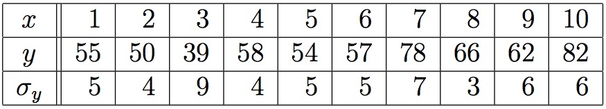
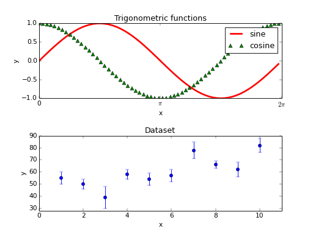

## Exercises

Most of these exercises should be put in a file called `homework2.py`. You
should make sure this file immediately runs all tests that you have written and
gives correct output for every exercise. The same goes for all other files you
submit.

### 2.0 General Notes on Functions

Before we start doing exercises, there are a few general but important things to know
about functions. Functions are an essential part of programming; they are used to 
perform tasks that may need to be performed more than once, and to split your program 
up in logical parts in a clear and useful way. They are used so much that most programs 
consist of only a few lines of main code. Almost every task is handled by functions, 
or functions of functions, and the main code is only used to call these functions with 
certain parameters. 

To keep the structure of your program clear, and to know where to look if you want to 
find the definition of a function, the convention is to put function definitions 
at the top of your script. The structure of your script then looks like this:

	## Name
	## Date
	## Short description of the program
	
	def function1(parameter1, parameter2):
		...
	
	def function2(parameter1, parameter2):
		...
	
	## ---------- Main ----------
	This is where you execute your program and call the functions that you need.

You will probably have to get used to this way of organizing your program, but you will soon
realize that it makes your code much easier to read and work with for others, or for yourself 
if you haven't seen your code in a while. You will also be graded on this under style.

Now, about functions, what can we use them for?

A function can be a mathematical function, exactly like we know functions from calculus. 
For example, $$f(x)=x^2$$ would be:

	def square(x):
		'''
		This function computes the square value. It has one parameter, number x.
		'''
		return x*x

Or it can do a job for you:

	def get_number():
		'''
		This function keeps asking for a number until the user gives a number. It has no parameters.
		'''
		number = input('Number: ')
		while type(number) != int:
			print 'That is not a number, please try again.\n'
			number = input('Number: ')
		return number

Note that we have included a short description and that we mention the 
parameters for both functions. This is also part of a good style.

Remember that these functions are not executed until you call them in your 
main code. With the first function, you can print the square value directly:

	print square(2)

Or you can save the square value to a variable and then print the variable:

	y = square(2)
	print y

The second method is preferred because there you can later print or use the 
variable again.

It might be obvious, but remember that whatever is put after return in your 
function will be sent to the position in your main code where you called the
function. You can then print it, save it to a variable, or use it in a computation.
You can also choose not to return anything, then the function returns `None`. 
However, the code inside the function is still executed and may contain print 
statements. The next section is all about the difference between print and return.

### 2.1 Print vs Return

Still no exercises, just another important bit of reading. These two
functions are defined:

	def f1(x):
	    print x + 1
	
	def f2(x):
	    return x + 1

Run this code in the shell. What happens when we call these functions?

	>>> f1(3)
	4
	>>> f2(3)
	4

It looks like they behave in exactly the same way. But they really don't. 
Try this:

	>>> print f1(3)
	4
	None
	>>> print f2(3)
	4

In the case of `f1`, the function, when evaluated, prints `4`; then it returns
the value `None`, which is printed by the Python shell. In the case of `f2`,
it doesn't print anything, but it returns `4`, which is printed by the Python
shell. Finally, we can see the difference here:

	>>> f1(3) + 1
	4
	Traceback (most recent call last):
	   File "<stdin>", line 1, in ?
	TypeError: unsupported operand type(s) for +: 'NoneType' and 'int'
	>>> f2(3) + 1
	5

In the first case, the function doesn't return a value, so there’s nothing 
to add to 1, and an error is generated. In the second case, the function 
returns the value 4, which is added to 1, and the result, 5, is printed by 
the Python read-eval-print loop.

For just about everything we do, it will be returned values that matter, 
and printing will be used only for debugging, or to give information to the
user.

Print is very useful for debugging. It's important to know that you can
print out as many variables and strings as you want in one line, when they 
are separated by commas. Try this:

	>>> x = 100
	>>> print 'x:', x, 'x squared:', x*x, 'sqrt(x):', x**0.5
	x: 100 x squared: 10000 sqrt(x): 10.0

---

### Intermezzo: Functions

So far we have been using `raw_input` to get user input. For the remainder of
this course we will move away from this tool, instead writing **functions**
that take in parameters as opposed to prompting the user for input. So, for
this and all following problems, do not use `raw_input` unless explicitly told
to do so.

---

### 2.2 Defining A Function

Recall how we define a function using `def`, and how we pass in parameters. 
In `homework2.py`, paste your code from exercise 1.8 (the rock, paper, scissors
game). Then, transform it into a function that takes parameters, instead of
asking the user for input. Make sure to return your answer, rather than 
printing it.

Think a bit about the name you give to the function. Discuss with your 
neighbor what name would be best.

### 2.3 Testing your function

Because rock, paper, scissors now is a function that returns a value,
you can easily call it in a test. Write three test cases for
rock, paper, scissors. Put them directly below your function and mark in a
comment that they are testing statements.

---

### Intermezzo: Testing

In order to quickly evaluate the code you have written, and to get some
practice in writing test, you are to include *at least 3* test cases below your
code for each exercise.

---

### 2.4 A few simple methods

In this problem you'll be asked to write two simple methods (*method* is an
interchangeable term for *function*). Be sure to test your functions well, 
including at least 3 test cases for each method.

1. Write a method `is_divisible` that takes two integers, `m` and `n`. The
   method returns `True` if `m` is divisible by `n`, and returns `False`
   otherwise.

   Here's three test cases for that one:

		# tests for is_divisible
		print "is_divisible(10, 5) == True",  is_divisible(10, 5) == True
		print "is_divisible(18, 7) == False", is_divisible(18, 7) == False
		print "is_divisible(42, 0) == ",      is_divisible(42, 0) == False
	
   Look at the conditions that they test and try to make sure your future 
   test cases are comprehensive.

2. Imagine that Python doesn't have the `!=` operator built in. Write a
   method `not_equal` that takes two parameters and gives the same result 
   as the `!=` operator. Obviously, you cannot use `!=` within your 
   function! Test if your code works by thinking of examples and making sure
   the output is the same for your new method as `!=` gives you.

### 2.5 The `math` module

In this exercise, we will play with some of the functions provided in the
`math` module. A **module** is a Python file with a collection of related
functions. To use the module, you need to add the following line at the top of
your program, right underneath the comments with your name:

	import math

If you want to find out what is $$sin(90^circ)$$, you first need to convert
from degrees to radians and then use the `sin` function in the `math` module:

	radians = (90.0 / 360.0) * 2 * math.pi
	print math.sin(radians)

You can do this work in the Python Shell by typing import math and then these
lines.

For mathematical functions, you can generally call `math.func`, where `func` is
whatever function you want to call. For example, if you want the sine of an
angle a (where a is in radians), you can call `math.sin(a)`. For logarithms,
the function `math.log(n)` calculates the natural logarithm of `n` (So that's
$$ln(n)$$ not $$log(n)$$!). You can calculate the log of any base b using
`math.log(n, b)`. The `math` module even includes **constants** such as $$e$$
(`math.e`) and $$pi$$ (`math.pi`).

Documentation for the math module is available at:  
<http://docs.python.org/release/2.6.6/library/math.html>

Many computations can be expressed concisely using the "multadd" operation,
which takes three operands and computes $$a ∗ b + c$$. One of the purposes of
this exercise is to practice pattern matching: the ability to recognize a
specific problem as an instance of a general category of problems.

In the last part, you get a chance to write a method that invokes a method you
wrote. Whenever you do that, it is a good idea to test the first method
carefully before you start working on the second. Otherwise, you might find
yourself debugging two methods at the same time, which can be very difficult.

1. Write a function `multadd` that takes three parameters, `a`, `b` and `c`.
   Write tests for your function before moving on.

2. Underneath your function definition, compute the following values using 
   `multadd` and print out the result:

   `angle_test = ` $$sin(pi/4) + cos(pi/4)/2$$
	
   `ceiling_test = ` $$\|~276/19~\| + 2 log_7(12)$$

   If you are unfamiliar with the notation $$\|~x~\|$$, this represents the 
   **ceiling** of a number. The ceiling of some `float x` means that we
   always "round up" `x`. For example, $$\|~2.1~\| = \|~2.9~\| = 3.0$$.
   Look at the `math` module documentation for a way to do this!

   If everything is working correctly, your output should look like:

       sin(pi/4) + cos(pi/4)/2 is: 1.06066017178
       ceiling(276/19) + 2 log_7(12) is: 17.5539788165

3. 	Write a new function called `yikes` that has one argument and uses the
    multadd function to calculate the following:

	$$xe^(-x) + sqrt(1-e^(-x))$$
	
	There are two different ways to raise $$e$$ to a power: check out the
	`math` module documentation. Be sure to `return` the result!
	Try $$x=5$$ as a test; your output should look like:
	
		yikes(5) is 1.0303150673

### 2.6 More functions

Here's three more functions to try your hand at.

1.	Write a method that takes one number as input and returns the absolute value.
	
2.	Write a method `rand_divis_3` that takes no parameters, generates and
	prints a random number, and finally returns `True` if the randomly 
	generated number is divisible by 3, and `False` otherwise. For this 
	method we'll use a new module, the `random` module. At the top of your
	code, underneath `import math`, add the line `import random`. We'll 
	use this module to generate a random integer using the function 
	`randint`, which works as follows:

		random.randint(lo, hi)

	where `lo` and `hi` are integers that tell the code the range in which
	to generate a random integer (this range is *inclusive*). 0 to 100 is
	probably a decent range.

3.	Write a method roll dice that takes in 2 parameters:

	* the number of sides of the die, and
	* the number of dice to roll
	
	and generates random roll values for each die rolled. Print out each
	roll and then return the string "That's all!". An example output:
	
    	>>> roll_dice(6, 3)
		4
		1
		6
		That's all!

### 2.7 Working with lists

Check out this function that sums all numbers in a list:

	def sum_all(number_list):
	    # number_list is a list of numbers
	    total = 0
	    for num in number_list:
	        total += num

	    return total

Note how we specify, with a comment, what the type of the **parameter** must
be. Here's two tests:

	# tests for sum_all
	print "the sum of [4, 3, 6] is:", sum_all([4, 3, 6])
	print "the sum of [1, 2, 3, 4] is:", sum_all([1, 2, 3, 4])

Now make a new function `cumulative_sum` that returns a new list where the 
$$i$$-th element is the sum of the first $$i+1$$ elements from the original list.
For example, the cumulative sum of `[4, 3, 6]` is `[4, 7, 13]`.

Next, we want to get some practice writing functions that we will often use in 
the rest of the course. Write the following functions, and from now on, use your own 
functions for these common tasks. Include three test cases with each function.

1.	Write a function that takes a list as argument and sums all the elements. Return 
	the sum.

2.	Write a function that finds the position of an element in a list. The function should
	take two arguments: a value and a list. Return the position of the first element that 
	contains the value, or `None` if there is none.

3.	Write a function that finds the maximum value in a list and returns it.

### 2.8 Plotting

Ooooh this is nice! Graphical output with Python. We will cover the basic plotting functions 
that you need in the next few weeks, but you are encouraged to look up functions yourself to 
create even better looking plots. Note however that even though you may use other functions 
for this part, you should still understand what is happening in your code, and we may ask you about it. 

Create a file called `pyplot.py` to save the exercises for this section. Put each example in a
separate function.

We will use the pyplot section of matplotlib, which is the main plotting library for Python.
To be able to use its functions, add `import matplotlib.pyplot as plt` to the top of your file.
We can now call any of the plotting functions as `plt.func`, where `func` is the function we want to use.

Now, let's make a plot of the `square()` function that we defined earlier. Remember the definition:

	def square(x):
		'''
		This function computes the square value. It has one parameter, number x.
		'''
		return x*x

The first thing we need is a range of x-values:

	xlist = range(-10,11)

We cannot multiply lists, so for the y-values we have to use a loop:

	ylist = []
	for xvalue in xlist:
		ylist.append(square(xvalue))

Now we can make a plot with the `plot` command. The absolute minimum we need is a command 
to create a plot of the y-values and a command to show our plot:
	
	plt.plot(ylist)
	plt.show()
	
You may have noticed that the y-values were not matched to the right x-values, because we didn't include 
the xlist-values. The full syntax of the `plot` command is: `plot(x,y,marker,x2,y2,marker2,...etc)`. There 
are many options for the markers, like `'r.'` for red dots, or `'go'` for green circles, or `'b--'` for blue dashes, etc.
Let's use red circles for now. We can also add some labels with `xlabel('label')` and `ylabel('label')`, 
and specify the plotting range with `axes([xmin,xmax,ymin,ymax])`. After setting all the options, we 
can show the plot with `show()`:

	plt.plot(xlist,ylist,'ro')
	plt.xlabel('x')
	plt.ylabel('y')
	plt.axis([-15,15,0,110])
	plt.show()

1.	As a first exercise, plot the sine and cosine function in one figure, in the x-range of $$0$$ to $$2pi$$. 
	To use the `sin()` and `cos()` function, you have to import the `numpy` module. This module also contains the 
	`arange(start,stop,step)` function, which you can use to create a range of values with a step size smaller than 
	one. Use a different color for each function.

Another form of graphical output that we're going to use is a histogram. The syntax for a histogram is `hist(x,bins)`, 
where `x` is a list of values and `bins` is the amount of bins that the data is divided into. A high number of
bins makes it easier to see fluctuations, but may result in a very low count per bin, so this number should always 
be tailored to your data. Try the following code, which shows a normal distributed range of IQs centered around 100.
Notice that we have added some text and included a grid to the histogram.

	import numpy as np
	import matplotlib.pyplot as plt
	
	mu = 100
	sigma = 15
	x = mu + sigma * np.random.randn(10000)
	
	# the histogram of the data
	plt.hist(x, 50,normed=1,facecolor='g')
	
	plt.xlabel('Smarts')
	plt.ylabel('Probability')
	plt.title('Histogram of IQ')
	plt.text(60, .025, r'$\mu=100,\ \sigma=15$')
	plt.axis([40, 160, 0, 0.03])
	plt.grid(True)
	plt.show()

For the next exercise you need to show two figures side by side. You can do this by using `subplot`.
The syntax is `subplot(numberofrows,numberofcolumns,activeplotnr)`. For example, the following code
creates a grid of four figures:

	import matplotlib.pyplot as plt
	
	plt.subplot(2,2,1)
	plt.xticks([]), plt.yticks([])
	plt.text(0.5,0.5, 'subplot(2,2,1)',ha='center',va='center',size=20)
	
	plt.subplot(2,2,2)
	plt.xticks([]), plt.yticks([])
	plt.text(0.5,0.5, 'subplot(2,2,2)',ha='center',va='center',size=20)
	
	plt.subplot(2,2,3)
	plt.xticks([]), plt.yticks([])
	plt.text(0.5,0.5, 'subplot(2,2,3)',ha='center',va='center',size=20)
	
	plt.subplot(2,2,4)
	plt.xticks([]), plt.yticks([])
	plt.text(0.5,0.5, 'subplot(2,2,4)',ha='center',va='center',size=20)
	
	plt.show()

2.	In this exercise we'll use everything we have learned so far to plot a set of
	datapoints that we're going to fit next week. Use the sine and cosine function
	from the previous exercise for the top figure, and this data for the bottom figure:
	
	

	To create the following plot:
	
	
	
	Functions that we haven't seen and you may want to use are:
	* `linewidth=3` - as an option for `plot`
	* `errorbar(x,y,yerror,fmt='o')` - instead of `plot()`
	* `xticks([0,np.pi,2*np.pi],[0,'$\pi$','$2\pi$'])`
	* `legend()` - without any options. Include a `label=...` in your `plot` command.
	* `subplots_adjust(hspace = 0.5)` to get the spacing of figures right.
	
Congratulations, you are now well-prepared for most of the plots that you will need to make in 
the rest of your study!

### Double check

For every problem, check the following:

* Have you put the problem in a function?
* Have you added the problem to the right Python file?
* Have you put your name on top of that file?
* Have you made sure the program is NOT interactive (e.g. we don't have to type anything)?
* Have you written at least three tests to show the program is correct, or even more tests if the problem prescribes this?
* Do the tests give the expected output?

### Hacker Exercises

When you have double checked and submitted your exercises, you can proceed with the hacker exercises. 
Do the recursion problems first, and then the bingo exercise.
