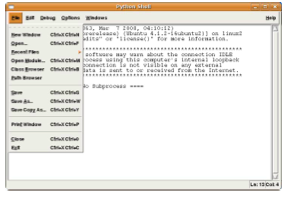

# Preparation

## Readings

How To Think Like A Computer Scientist: Monday - chapters 1 (all), 2 (all) & 4.12. Tuesday - Chapter 4.1, 4.2, 4.4-4.7, 6.1 & 6.2.

## What to turn in

Turn in a printout of your code exercises, stapled to your answers to the written exercises, at 2 PM on Wednesday, January 5th.

## Exercise 1.0 – Installing Python

Follow the instructions on installing Python and IDLE on your own computer on the Materials page of the course website, in the Handouts section. Be sure to install Python 2.6.x. Ask an LA for help if you run into any trouble. Before continuing, play around with the Python shell a bit and explore how you can use it as a calculator.

## Exercise 1.1 – Hello, world!

Recall that a program is just a set of instructions for the computer to execute. Let’s start with a basic command: print x: Prints the value of the expression x, followed by a new line.

Create a new program called hello world.py. You will use this file to write your very first ‘Hello, world!’ program, as well as your answers for the rest of the exercises for today. How to create a program file:

1. Open a new window by choosing New Window from the File menu.

	

2. Save the file as hello world.py. Do NOT skip the '.py' portion of the file name - otherwise, you will lose out on syntax highlighting!

	

3. Start every program with a bank of comments, with a comment line for your name, your recitation section, the name of your file, and today’s date. Recall that a comment line begins with a ‘#’ (pound) symbol.

You can now write your very own Hello, world! program. This is the first program that most programmers write in a new programming language. In Python, Hello world! is a very simple program to write. Do this now... it should be only be one line!

When you are done, save your work and run it. Your code should look similar to this:

To run your program, chose Run Module from the Run menu (or just hit F5 on Windows/Linux, or fn-F5 on a Mac). When you run the code, your shell should look similar to this:

When you run your code, it first prints the line >>> ===== RESTART =====, then runs your code underneath that line.

## Exercise 1.2 – Printing
From the course website, download the homework 1.py template. Remember to put your name and section at the top. If you don’t we’ll be highly grumpy.
Write a program using print that, when run, prints out a tic-tac-toe board. Remember to save your program regularly, to keep from losing your work! The purpose of this exercise is to make sure you understand how to write programs using your computing environment; many students in introductory courses experience trouble with assignments not because they have trouble with the material, but because of some weird environment quirk.

Expected output:
|| -------- || -------- ||

Exercise 1.3 – Variables
Recall that variables are containers for storing information. For example, Program Text:
a = ‘‘Hello, world!’’
print a
Output:
Hello, world!
The = sign is an assignment operator which tells the interpreter to assign the value ‘‘Hello, world!’’ to the
variable a. Program Text:
a = ‘‘Hello, world!’’
a = ‘‘and goodbye...’’
print a
Output:
and goodbye...
Taking this second example, the value of a after executing the first line above is ‘‘Hello, world!’’. But, after executing the second line, the value of a changes to ‘‘and goodbye...’’. Since we ask the program to print out a only after the second assignment statement, that is the value that gets printed. If you wanted to save the values of both strings, you should change the second variable to another valid variable name, such as b.
Variables are useful because they can cut down on the amount of code you have to write. In homework 1.py, write a program that prints out the tic-tac-toe board from exercise 1.2, but which uses variables to cut down on the amount of typing you have to do. Hint - how many different variables should you need?
Exercise 1.4 – Operators/Order of Operation
Python has the ability to be used as a cheap, 5-dollar calculator. In particular, it supports basic mathematical operators +, -, *, / as well as the power operator (**) and the modulus operator (%).

Program Text:
x=5+7 print x
y = x + 10 print y
Output:
12 22
Note that we can use variables in the definition of other variables! Mathematical operators only work on numbers­ ints or floats. Statements such as ’Hi’ + 5 or ’5’ + 7 will not work.
Part I: Input the following sets of equations, and note the difference between int arithmetic and float arithmetic. You can do this just in your interpreter (you don’t need to turn anything in for this part), but pay attention to the output!
1. 5, 5 , and 5.0 Note that as long as one argument is a float, all of your math will be floating point! 22.0 2
�1� �1� 2.7∗ 2 and7∗ 2.0
3. 5∗∗2, 5.0∗∗2, and 5∗∗2.0
4. 1 Note the final digit is rounded. Python does this for non-terminating decimal numbers, as computers 3.0
cannot store infinite numbers! Take 6.004 to find out more about this...
Part II: In homework 1.py, transcribe the following equations into Python (without simplifying!), preserving order of operation with parenthesis as needed. Save each as the value of a variable, and then print the variable.
1.
2. 3. 4. 5.
3×5 2+3
√
7+9×2 (4−7)3
√
4 −19+100
6 mod 4 - If you aren’t familiar with modular arithmetic, it is pretty straightforward- the modulus operator, in the expression x mod y, gives the remainder when x is divided by y. Try a couple modular expressions until you get the hang of it.
Part III: In homework 1.py, use order of operation mathematics to create two equations that look the same (ie, have the same numbers) but evaluate to different values (due to parenthesization). Save each as the value of a variable, then print the variables.
Exercise 1.5 – User input
Do this exercise in homework 1.py. In this exercise, we will ask the user for his/her first and last name, and date of birth, and print them out formatted. Recall that you can get input from the user using the command raw input(‘‘text’’), as shown in lecture.

Note: There are two functions to get user input. The first, raw input, turns whatever the user inputs into a string automatically. The second, input, preserves type. So, if the user inputs an int, or a float, you will get an int or a float (rather than a string). Be careful though- you still want to use raw input if you want a string back, or otherwise the user will have to put quotes around their answer. Use raw input here - it’s good for string processing, like this problem. input will come in handy when using user input to compute math - like in Exercise 1.8.
Here is an example of what this program should do: Output:
Enter your first name: Chuck
Enter your last name: Norris
Enter your date of birth:
Month? March
Day? 10
Year? 1940
Chuck Norris was born on March 10, 1940.
To print a string and a number in one line, you just need to separate the arguments with a comma (this works for any two types within a print statement). The comma adds a space between the two arguments. For example, the lines:
mo = ’October’
day = ’20’
year = ’1977’
print mo, day, year
will have the output
October 20 1977
-------------------------------------------------------------------------------
OPTIONAL: Now, for something completely different... a discussion on how to print strings, most prettily...
Note that none of the commas are in this output! To do that you want something like this:
print mo, day+’,’, year.
The + sign concatenates two strings, but can only be used on two strings. Using it on a number and a string will cause an error (because it is ambiguous as to what you want the program to do!)
That’s why it’s a great idea to use raw input for this problem; if you use input you’d have to convert the int to a string. We’ll cover this more in-depth on Thursday, when we get to strings, but you may want to play with string concatenation operations now to get everything to look its prettiest.
-------------------------------------------------------------------------------
At this point, we suggest completing written exercises 1.9 - 1.11 to cement your understanding of Monday’s topics. Exercises 1.6-1.8 and 1.12-1.15 cover Tuesday’s topics.

