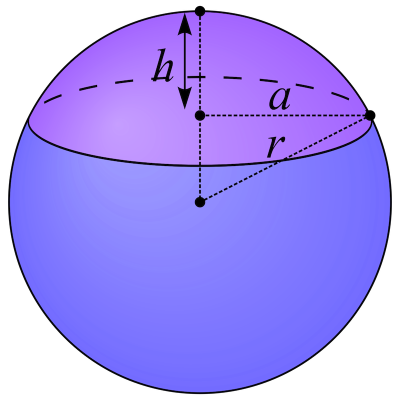

# Numeriek integreren - Monte Carlo (de opgaves)

Bereken, gebruikmakend van de Monte Carlo-techniek de volgende integralen. 
Maak ook een grafiek met behulp van Matplotlib.

### opgave 2.1 blabla
Hint: test door

### opgave 2.2 blabla
Hint: test door

### opgave 2.3 blabla
Hint: test door

### opgave 2.4 spherical cap

{:.inline}{: style="width:50px"} Hier wat tekst zodat het plaatje in de tekst geplaatst wordt.

# Numeriek integreren - Monte Carlo (de theorie)

Benader de integraal door gebruik te maken van random getallen. Gooi in 
een gebied rond de integratie regio random punten en kijk welke fractie 
binnen het integratiegebied valt.

### a] Het probleem

Gegeven f(x) op a $leq$ x $leq$ b: bereken $int_a^b f(x)dx$

### b] Definieer een ’box’ om de integraalregio heen:

Definieer een box om de integraalregio heen: definieer een 
$x\_(min)$, $x\_(max)$, $y\_(min)$ en $y\_(max)$ zodanig 
dat: $x\_(min) \leq$ a en $x\_(max) \geq$ b en dat ook geldt: 
voor a $leq$ x $leq$ b: $y\_(min) leq f(x) leq y\_(max)$. 
In de meeste toepassingen wordt gekozen voor $x\_(min)$ = a en $x\_(max)$ = b.

### c] Gooi random punten in de box:

Gooi een groot aantal random punten ($x_i$,$y_i$) in de box:

  * $x_i$ : random getal tussen $x\_(min) $ en $x\_(max)$
  * $y_i$ :	random getal tussen $y\_(min) $ en $y\_(max)$

en bekijk voor elk punt of het binnen de functie ligt ("goed") of erbuiten ("fout"):

Hierbij geldt dus: "goed": $y\_i < f(x\_i)$ of "fout": $y\_i > f(x\_i)$

Let op: bij negatieve f(x) draait definitie om. Visualiseer altijd de functie.

### d] Bepaal de integraal:

De integraal is de fractie punten die binnen de grafiek vallen keer de 
oppervlakte van de totale box. In ons geval (rechthoek als box) geldt dan:

$int_a^b f(x)dx = \frac(N\_(goed))(N\_(goed)+N\_(fout)) (x\_(max)-x\_(min)) (y\_(max)-y\_(min))$

### Extra:

In "echte" toepassingen wordt uit het oogpunt van efficiëntie de box vaak zo gekozen dat hij de integraal zo nauw mogelijk omsluit. De fractie goede worpen is dan zo groot mogelijk.
