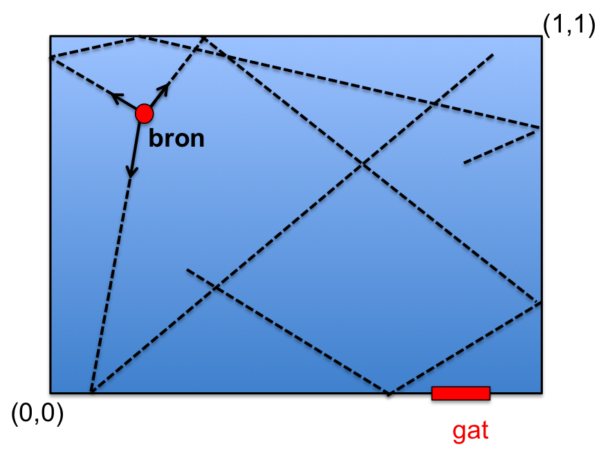
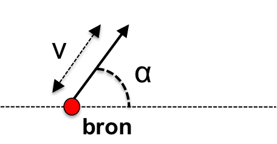

# Opgave 1: Simulatie - deeltjes in een doos

In een doos (afmeting: $0 \leq x \leq 1$ en $ 0 \leq y \leq 1$) worden 
op een plek ($x_(source)$,$y\_(source)$) = (0.25,0.75) op t=0 een aantal 
deeltjes geproduceerd met een random snelheid en richting.
{:.inline}{: style="width:250px"}

We gaan in deze opgave bekijken hoe deze deeltjes zich door de doos gaan 
verplaatsen als functie van de tijd. De deeltjes ketsen elastisch tegen 
de wanden kunnen de doos niet uit.

Schijf een programma `doos.py` en genereer een (groot) aantal deeltjes $i$.
Geef elk van de deeltjes een random richting en snelheid op t=0:
{:.inline}{: style="width:200px" align="left"} 

* snelheid ($v\_i$): 0 < $v\_(i)$ < 0.10

* hoek($\alpha$):  $0 < \alpha < 2\pi$

Bepaal voor elk de snelheid in de x-richting ($v\_(x)$) en de y-richting ($v\_(y)$) 
en volg het deeltje daarna in de tijd (door kleine stappen in t te nemen). Hou 
hierbij steeds de positie en snelheden van de deeltjes bij, zowel in de x-richting 
als de y-richting.

### Natuurkunde tip: 
* gebruik: $x\_(i+1) = x\_(i) +v\_(x,i)\Delta t$. 
* behandel de x- en y-richting afzonderlijk

### Algemene tip:
test je code door te volgen (pad in grafiek) hoe 1 of 2 deeltjes door de doos bewegen.

.

# opgave 1 (deel A): de gesloten doos:

Voor de eerste 2 sub-opgaves is de doos volledig gesloten en is het aantal deeltjes 
dus constant.

### opgave 1.1: uniformiteit

Maak een grafiek van het aantal deeltjes aan de rechterkant van de doos 
($x\_(i) > 0.5$) als functie van de tijd.

### opgave 1.2: gemiddelde afstand

Maak een grafiek van de gemiddelde afstand tussen de deeltjes als functie van de tijd.

# opgave 1 (deel B): een gat in de doos:

Stel nou dat er een gat in de doos zit ($y\_(gat) = 0$ en $0.8 \leq x\_(gat) \leq 0.9$). 
Het is nu dus mogelijk dat deeltjes uit de doos ontsnappen.

### opgave 1.3: wegraken deeltjes (normaal)

Maak een grafiek van het aantal deeltjes in de doos als functie van de tijd. Wat is de tijd 
waarop de helft van de deeltjes uit de doos ontsnapt is: $t\_(1/2)$ ? Probeer ook eens in 
een discussie met je mede-studenten zonder het computerprogramma een schatting te geven. 

### opgave 1.4: wegraken deeltjes (warmer gas)

Stel nou dat de deeltjes gemiddeld met een 2x hogere hogere snelheid beginnen: $v\_(i)$ is 
random tussen 0 en 0.20. Maak weer dezelfde grafiek als bij opgave 1.3 en bepaal opnieuw 
$t\_(1/2)$. Hoe verschillen deze ?

