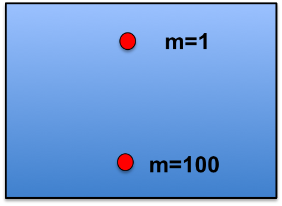
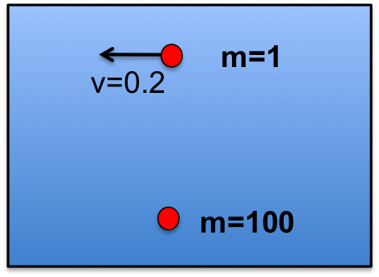
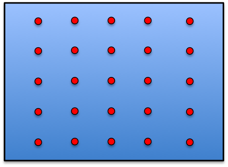
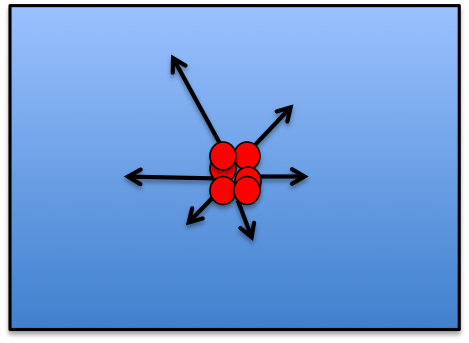

# Simulatie: clusteren van massa in het heelal

We gaan het heelal simuleren. Nou ok, een bescheiden 2-dimensionaal heelal met
een klein aantal deeltjes en alleen de zwaartekracht, maar toch. Het is
precies wat verschillende onderzoeksgroepen (bijvoorbeeld [*MICE
collaboratie*](http://maia.ice.cat/mice/) ) doen: bedenk een initieel heelal,
reken door hoe het er 13 miljard jaar later uitziet en vergelijk het met de
huidige observaties.

1. Initieer het heelal. In ons geval een 2-dimensionale doos van 1 bij 1.

2. Initieer de deeltjes in het heelal (dichtheidsverdeling en type).

3. Bepaal voor elk deeltje de netto kracht die hij ondervindt van alle andere 
   deeltjes. Dit kan je gebruiken om de versnelling uit te rekenen.

4. Neem een kleine stap in de tijd en bepaal de nieuwe snelheid en positie.

5. Ga terug naar stap 3.

In ons geval beginnen we simpel. We gebruiken puntdeeltjes met massa $m$
(meestal $m=1$) en gebruiken alleen de zwaartekracht. De kracht tussen de
deeltjes is dus gegeven door:

$F = G\frac(Mm)(r\^(2))$ 

In deze opgave kies je het heelal groot: er zijn geen randen. Het is handig 
om je assenstelsel niet precies rond (0,0) te kiezen omdat je dan soms in de 
knoop komt met min-tekens etc.

## Natuurkunde-tips

* Zorg dat je G kan veranderen in je programma: het is een algemene
  schaalfactor. Gebruik het om je programma te 'versnellen' zo nodig.

* Behandel x en y afzonderlijk.

* Gebruik (zelfde voor y): $x\_(i+1) = x\_(i) + v\_(x,i)\Delta t$.

* Gebruik (zelfde voor y): $v\_(x,i+1) = v\_(x,i) + a\_(x,i)\Delta t$.

Net als in de vorige opgave gaan we een programma schrijven (`heelal.py`) om
te bekijken hoe een groep deeltjes zich gaan verplaatsen. Volg de deeltjes in
de tijd (neem kleine stapjes in $t$) en hou positie, snelheid en versnelling
van de deeltjes bij.

Probeer voor elke opgave een animatie van je heelal te maken zodat je ziet 
wat er gebeurt.

## Opgave 2.1: Felix Baumgartner

{:.inline}{: style="width:200px"}

Initieer een heelal met 2 deeltjes: een grote massa M=100 op ($x,y$) = (0.5,0.1) 
en een kleine massa m=1 op (x,y) = (0.5,0.9). Bepaal op welke $y$-waarde de 
deeltjes elkaar tegenkomen: $y\_(collide)$. Specifiek: maak een grafiek van 
$y\_(collide)$ als functie van de grote massa M. Kies hierbij M in de range 
tussen 1 en 1000 (paar stappen). 

In deze opgave is het goed om wat check-plots te maken om wat van de fysica 
te volgen (en tegelijk je programma te checken). Maak in deze opgave grafieken 
van:

* de $y$-positie van de kleine en grote massa als functie van de tijd
* de totale kinetische energie als functie van de tijd

Een goede test zou bijvoorbeeld zijn om te beginnen met 2 deeltjes met gelijke massa.

Let op: zoals eerder gemeld kan je het assenstelsel ook verplaatsen en G vergroten 
of verkleinen. Het gaat om de natuurkunde-dynamica van het systeem.

## Opgave 2.1: satellieten

{:.inline}{: style="width:200px"}

In deze situatie geven we de kleine massa een snelheid loodrecht op de as naar 
de grote massa toe. Schrijf een programma dat de dynamica van het systeem nabootst:

* een animatie van het systeem
* de afstand tussen de 2 deeltjes als functie van de tijd
* de beweging van het massamiddelpunt als functie van de tijd
* een grafiek van de kinetische energie en potentiele energie van de kleine massa

# Hacker editions

## HACKER EDITION opgave 2.3: uniform heelal

{:.inline}{: style="width:200px"}

Initieer een heelal met 25 deeltjes: uniform (5x5), dus deeltje 1 bevindt 
zich op $(x\_(1),y\_(1)) = (0.10, 0.10)$ en $\Delta\_(x)$ en $\Delta\_(y)$ 
zijn steeds 0.20. 

Kijk hoe de deeltjes gaan bewegen. Specifiek:

* Plot de gemiddelde afstand tussen de deeltjes als functie van de tijd
  (clusteren de deeltjes inderdaad?).

* Plot de totale kinetische energie als functie van de tijd (wat betekent dit
  in een statisch heelal?).

Als je code werkt, probeer het dan eens met een groter aantal deeltjes.

## HACKER EDITION opgave 2.3: de Big Bang

{:.inline}{: style="width:200px"}

Initieer een heelal met 100 deeltjes die uit één punt komen (midden van de
doos). Maak in deze opgave de doos heel erg groot zodat er effectief geen
randen zijn.

* Plot de gemiddelde afstand tussen de deeltjes als functie van de tijd
  (hoe lang duurt het voor de deeltje weer bij elkaar komen).

* Plot de totale kinetische energie als functie van de tijd.
