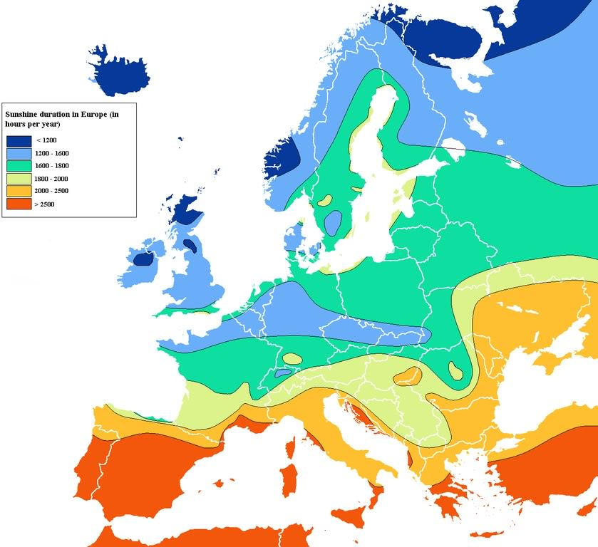

# Data-analyse: temperatuur in Nederland

{:.inline}{:style="width:200px"}

Laten we een steentje bijdragen aan de klimaatdiscussie en data analyseren 
die door de ECA (European Climate Assessment) beschikbaar wordt gemaakt in 
grote ASCII files. Data sets zijn hier beschikbaar: 
[ECA data-sets](http://eca.knmi.nl/dailydata/predefinedseries.php)
Voor elk weerstation, bijvoorbeeld station *XXX* zijn er 2 files: 
*TX_STAID000XXX* en *TN_STAID000XXX* met respectievelijk de maximum 
en minimumtemperatuur voor elke dag.

We beginnen bescheiden: de temperatuur in De Bilt (station 162). Omdat de 
data sets groot zijn hebben we die van De Bilt hier beschikbaar gemaakt. 
Download deze files: [`TX_STAID000162.txt`](TX_STAID000162.txt) en 
[`TN_STAID000162.txt`](TN_STAID000162.txt), open ze en lees bovenin hoe de 
data gecodeerd is. We zien bijvoorbeeld dat de maximum(minimum) temperatuur 
op 1 januari 1901 -3.1(-6.8) graden C was. Schrijf een programma dat deze 
file doorloopt en beantwoord de volgende vragen.

### Note:

* In elke ASCII files zijn er uitzonderingen. Er zijn hier bijvoorbeeld in De Bilt 2 *sources* gebruikt (522 en 2128). De eerste keer dat 2128 gebruikt is 
is 1 juni 1953, dus ook als de eerste 1000 entries hetzelfde zijn hoeft de rest niet te kloppen. 
* Bouw altijd tests in en wees verdacht op bizarre resultaten.
* Test je 'loop' programma op de eerste paar dagen zodat je precies kan checken wat er gebeurt. 
Kan je bijvoorbeeld de temperatuur op 1, 2 en 3 januari 1901 voorspellen.

### opgave 1.1: de extremen

Wat zijn de hoogste en laagste temperatuur die in De Bilt in de 20ste eeuw zijn gemeten ? Op welke dagen was dat ?

### opgave 1.2: elfstedentochten

Wat is de langste periode dat het aaneengesloten heeft gevroren (maximumtemperatuur onder 0 graden Celcius) 
en wanneer eindigde deze periode ?

### opgave 1.3: gemiddelde temperatuur voor specifieke dag in het jaar (abdicatie)

Schrijf een functie die voor een gegeven input (maand en dag) de gemiddelde maximale temperatuur 
teruggeeft als return value. Voor de duidelijkheid: als je 5 als maand en 30 als dag meegeeft moet 
je functie de gemiddelde (maximum) temperatuur op 30 mei teruggeven, gemiddeld over de jaren 1900 
tot en met 1999.

Gebruik de functie om te bepalen of het op koninginnedag (30 april) gemiddeld warmer is dat op 27 april 
(de nieuwe koninginne- / koningsdag).

### opgave 1.4 uitbreiding vraag 1.3 met grafieken

Breid de functie uit vraag 1.3 uit met een optie om een grafiek te maken (histogram) van de 
maximum temperatuur voor die specifieke dag. Maak vervolgens een grafiek van de maximum temperatuur 
op je verjaardag voor de gehele 20ste eeuw.

### opgave 1.5: gemiddelde temperatuur voor een specifieke maand in een specifiek jaar

Schrijf een functie die voor een gegeven input (jaar en maand) de gemiddelde maximum 
temperatuur teruggeeft (return value).

Zorg ervoor dat, nadat je het programma hebt aangeroepen, het resultaat keurig op het scherm 
geprint wordt met de maand in letters en de temperatuur op 2 decimalen nauwkeurig.

### opgave 1.6: uitbreiding vraag 1.5 met grafieken

Schrijf een functie die, gebruikmakend van de functie uit vraag 1.5 een grafiek maakt van de 
gemiddelde maximum temperatuur per maand (y-as) als functie van de maand (x-as) in de 20ste eeuw. 

### HACKER EDITION: uitbreiding vraag 1.2
Als we de eis iets verlagen: de maximale temperatuur mag 1 dag boven nul geweest mag zijn, wat is 
dan de langste periode dat het gevroren heeft ? Wanneer eindigde deze ?

### HACKER EDITION: trends (nalyse aantal extreem koude en warme dagen)

Bepaal het aantal dagen per jaar dat het extreem koud (minimum temperatuur < -8 ◦C) en extreem 
warm was (max. temp. > 28 ◦C) en maak een grafiek van beide als functie van het jaar voor de 
gehele 20ste eeuw. Zie je een trend ?

### HACKER EDITION: dubbels files inlezen
Vergelijk de temperaturen van je 2 favoriete europese weerstations. Zitten er interessante observaties tussen ?

